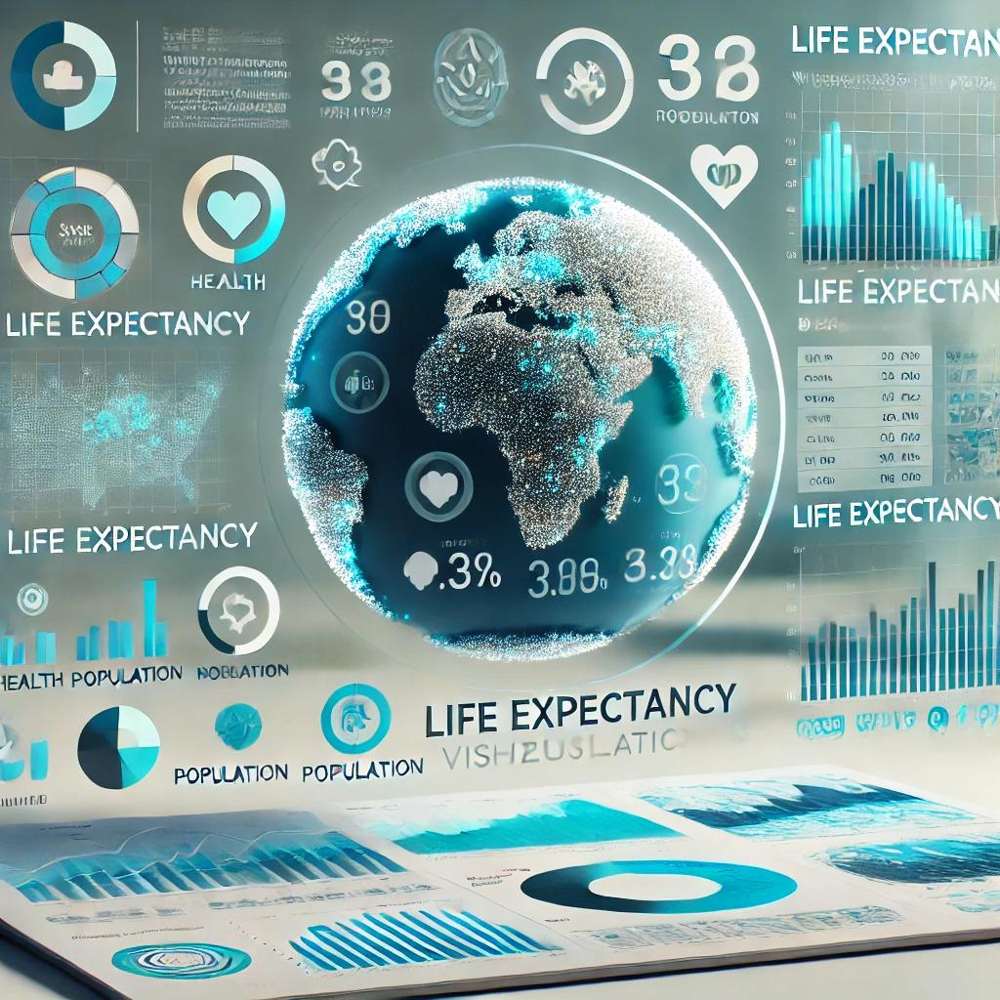

# Life Expectancy, Health Expenditure, and GDP Analysis

## Overview  
This project presents an in-depth analysis of life expectancy, health expenditure, and GDP across continents, leveraging data visualization tools to uncover insights. The aim is to identify patterns and regional disparities that could inform stakeholders and drive data-driven decision-making.  

The analysis focuses on three core aspects:  
1. **Life Expectancy** - Average life expectancy across continents.  
2. **Health Expenditure** - Trends in total health expenditure over time by continent.  
3. **GDP Composition** - Contribution of different continents to global GDP.  

The project showcases the use of Power BI for advanced data visualization and insight generation(Png files show visual analysis)

---

## Features  
- **Interactive Dashboards**: Detailed visualizations for life expectancy, health expenditure trends, and GDP by continent.   
- **Regional Analysis**: Comparison of metrics across continents to highlight disparities and trends.  
- **Dynamic Storytelling**: Tailored messages to explain complex visualizations effectively.  

---

## Visualizations  
1. **Life Expectancy by Continent**:  
   - A bar chart illustrating average life expectancy across continents.  
   - Insight: Europe leads in average life expectancy, while Africa records the lowest.  

2. **Health Expenditure Trends**:  
   - An area chart depicting total health expenditure from 2000 to 2015 across continents.  
   - Insight: Health expenditure increased consistently, with variations in regional growth rates.  

3. **GDP Composition by Continent**:  
   - A treemap showcasing the share of global GDP by continent.  
   - Insight: Europe contributes the largest share, with potential outliers in specific regions.  

---

## Key Insights  
- **Data Interpretation Challenges**: Due to the large number of countries, direct visualizations were difficult to interpret. Aggregating data by continent enabled clearer insights.  
- **Outlier Awareness**: The analysis highlighted potential outliers in GDP composition for certain continents, which warrant further investigation.  
- **Health Expenditure Impact**: Regions with higher health expenditure tend to record better life expectancy outcomes, though additional factors may influence this trend.  

---

## Tools Used  
- **Power BI**: For creating dynamic and interactive visualizations.  
- **Microsoft Excel**: For data preprocessing and analysis.  

---

## How to Use  
1. Clone the repository to your local machine:  
   ```bash
   git clone https://github.com/Codeking/life-expectancy-analysis.git
   ```  
2. Open the Power BI report (`Life_Expectancy_Analysis.pbix`) to explore the visualizations.  
3. Review the insights and recommendations outlined in the included documentation.

---

## Recommendations  
- **Future Research**: Investigate specific factors driving outliers in GDP and health expenditure.  
- **Policy Implications**: Use findings to guide regional investment in health infrastructure.  
- **Additional Metrics**: Consider incorporating factors like education, employment, and urbanization for deeper insights.  

---
Feel free to use, adapt, or improve upon this analysis for research or educational purposes. Feedback is welcome!  
