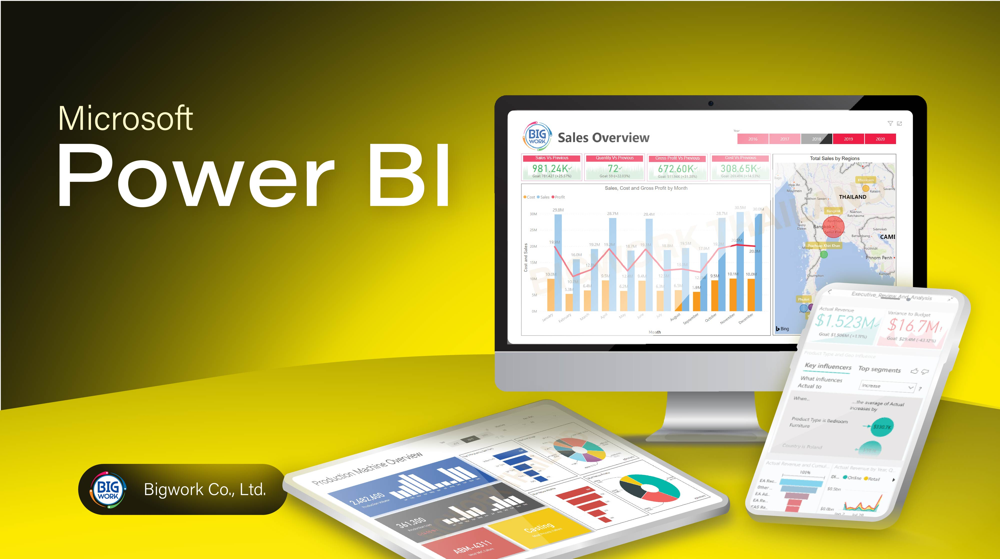

---

# Power BI Visualizations Repository  

## 🎯 Overview  
This repository showcases a collection of dynamic and insightful Power BI dashboards and reports created to analyze and visualize various datasets. Each visualization leverages Power BI's powerful data modeling and design capabilities to deliver actionable insights and tell compelling data stories.  

Whether you are a business professional, data analyst, or simply a data enthusiast, these visualizations demonstrate how data can be transformed into meaningful and interactive insights.  

---

## 📋 Contents  
This repository includes:  
- **Sales Dashboards**: Trends in sales of fruits and vegetables across selected countries.  
- **Revenue Analysis**: Financial performance visualizations across regions and time periods.  
- **Customer Behavior Reports**: Insights into consumer trends and preferences.  
- **Life Expectancy Analysis**: Visualization of health and demographic indicators over time.  
- **Custom Metrics Dashboards**: Tailored dashboards for specific KPIs and business metrics.  

---

## 🔑 Features  
- **Interactive Dashboards**: Clickable filters, slicers, and visuals for real-time insights.  
- **Clean Design**: Minimalistic, easy-to-read reports tailored for decision-makers.  
- **Data Preparation**: Pre-cleaned datasets with transformations applied in Excel, SQL, and Power BI Query Editor.  
- **Custom Visuals**: Unique graphs, KPIs, and visuals designed to highlight the most relevant metrics.  

---

---

## 🌟 Why This Repository?  
This repository was created to demonstrate the power of data visualization and provide examples of how complex datasets can be turned into actionable insights. It's perfect for:  
- **Businesses**: Learn how to create impactful dashboards for decision-making.  
- **Learners**: Explore Power BI capabilities and improve your own skills.  
- **Collaborators**: Partner with me on future data visualization projects.  

---

## 📫 Get in Touch  
If you have questions, feedback, or collaboration ideas, feel free to reach out:  
Contact info on BIO.

---

## ⚡ Fun Fact  
Did you know? Power BI processes **petabytes** of data each month globally to power business decisions!

