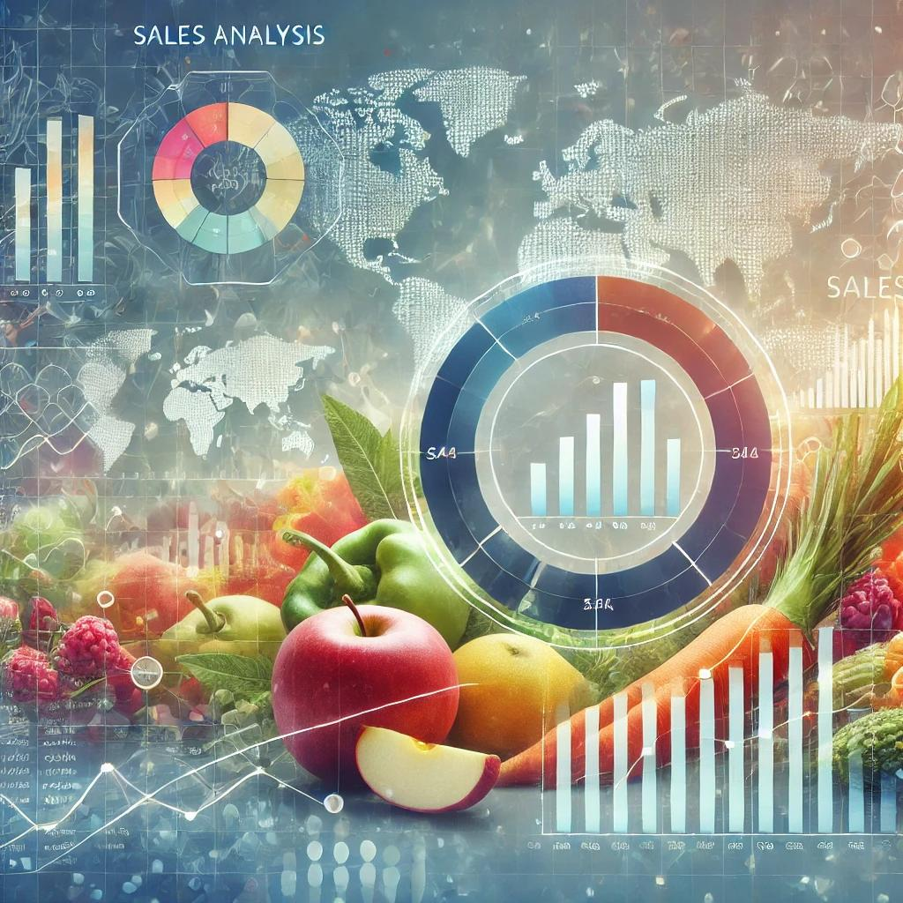

# Fruit and Vegetable Sales Analysis

### Overview
This project provides an in-depth analysis of fruit and vegetable sales trends across selected countries, aimed at identifying patterns and insights to support business and strategic decision-making. The data was cleaned and prepared in Excel, with conditional formatting applied to enhance readability. An interactive dashboard was also developed in Excel to visualize key metrics, making it easier to identify trends at a glance.

### Project Details
- **Data Cleaning**: Performed in Excel to ensure data quality and consistency. This included handling missing values, correcting data types, and standardizing formats.
- **Conditional Formatting**: Applied in Excel to highlight significant values, trends, and anomalies within the dataset, making insights more accessible.
- **Dashboard Creation**: Designed an interactive dashboard in Excel to visualize and summarize the sales performance across different countries and time periods.

### Power BI Visualizations
The Power BI report builds upon the Excel analysis, offering more dynamic visualizations and drill-down capabilities. Key metrics and visuals include:
- **Sales Trends Over Time**: Line charts showcasing seasonal patterns and annual growth rates.
- **Country-wise Performance**: Bar and column charts comparing sales volume and revenue across countries.
- **Product Breakdown**: Pie charts and bar charts to show sales distribution across different types of fruits and vegetables.
- **KPIs**: Key performance indicators to highlight high-level metrics such as total revenue, average sales per country, and top-performing products.

### Skills and Tools Used
- **Excel**: Data cleaning, conditional formatting, and dashboard design.
- **Power BI**: Data visualization and interactive dashboard creation.

### How to Access the Report
To view the Power BI report:
1. Download the `.pbix` file from this repository.
2. Open it in Power BI Desktop to explore the dashboard and interact with the visuals.

### Insights
This analysis provides valuable insights, including:
- Seasonal sales fluctuations in the fruit and vegetable market.
- Top-performing countries and products, supporting strategic decisions for market focus.
- Potential growth areas based on comparative sales performance.
